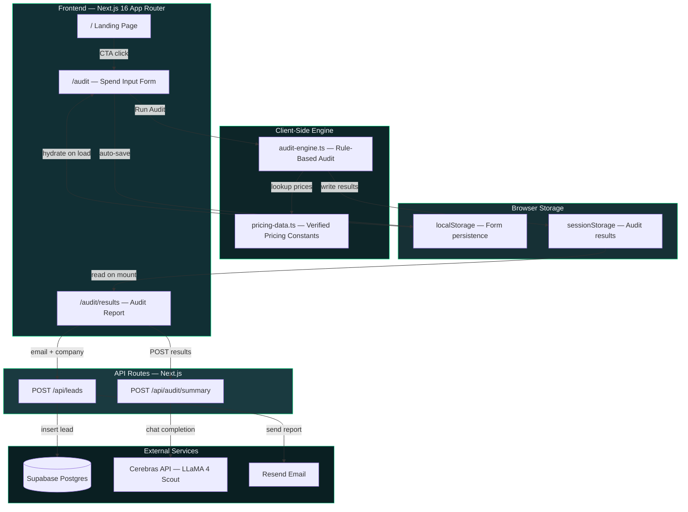

# Architecture — BurnLens

## System Overview



## Data Flow

1. **User lands** on the landing page from a tweet, blog post, or direct link
2. **User inputs** their AI tool stack: tools, plans, monthly spend, seats, team size, use case
3. **Form data persists** in `localStorage` via a lazy `useState` initializer — survives page reloads and accidental closes
4. **Audit engine runs client-side** (pure function, no API call). Evaluates each tool against 6 rules:
   - Plan-fit analysis (team plan overkill for small team?)
   - Same-vendor cheaper plan recommendation
   - Overpaying vs. retail price detection
   - Seat right-sizing (more seats than team members?)
   - Cross-vendor alternative with better pricing
   - Credex credit discount opportunity (~15%)
5. **Results written** to `sessionStorage` and user is routed to `/audit/results`
6. **Results page hydrates** from `sessionStorage` via lazy `useState` initializer
7. **Cerebras API** generates a ~100-word personalized summary via `POST /api/audit/summary` (with deterministic template fallback if API is unavailable)
8. **Lead capture** (post-value — user sees savings first): email + optional company → `POST /api/leads` → Supabase (or console log in dev)
9. **Honeypot field** silently catches bot submissions without affecting real users

## Key Architecture Decisions

### Client-Side Audit Engine (No Server Round-Trip)

The audit engine (`lib/audit-engine.ts`) runs entirely in the browser. This was deliberate:

- **Zero latency** — Results appear instantly, no spinner for the core audit
- **Zero cost** — No API calls means zero marginal cost per audit
- **Offline capable** — The engine works without network after initial page load
- **Testable** — Pure function with no side effects; 13 unit tests cover all 6 rules

Trade-off: The pricing data is bundled in the client, making it slightly larger (~8KB). This is acceptable because pricing data changes quarterly, not daily.

### Browser Storage Instead of Database (for MVP)

Form state uses `localStorage`, audit results use `sessionStorage`. No database required for the core audit flow:

- **No signup friction** — User never creates an account
- **GDPR-friendly** — No PII touches our servers unless user opts into lead capture
- **Fast iteration** — No schema migrations during rapid development

Trade-off: Results aren't shareable via URL (yet). This is the top priority for Week 2 — add Supabase persistence + unique `share_id` for each audit.

### Template Fallback for AI Summaries

The Cerebras API call has a deterministic template fallback:

```
API available → AI-generated summary (source: "ai")
API unavailable → Template summary with same data (source: "template")
```

This means the product **never breaks** if the AI service is down. The template uses the same audit data to produce a reasonable summary. Users see a "Cerebras AI" or "Auto-generated" badge so there's transparency.

## Stack Justification

| Choice | Why |
|--------|-----|
| **Next.js 16 (App Router)** | SSR for dynamic OG tags on shareable URLs; API routes eliminate need for a separate backend; Vercel deployment is zero-config |
| **TypeScript** | Type safety for the audit engine's pricing data and calculation logic; catches bugs at compile time; no `any` types in codebase |
| **Tailwind CSS v4** | `@import`-based architecture, rapid iteration on a design-heavy product; CSS custom properties for the Credex design system |
| **Supabase** | Free-tier Postgres with REST API; real relational database; used for lead storage with planned expansion to full audit persistence |
| **Cerebras API** | Ultra-fast inference (~200ms) for real-time summary generation; OpenAI-compatible API format; free tier available; LLaMA 4 Scout 17B is sufficient quality for short summaries |
| **Resend** | 100 emails/day free tier; planned for transactional audit report emails |
| **Vitest** | Fast, modern test runner with native TypeScript support; jsdom environment; 13 tests run in <15ms |

## Scaling to 10,000 Audits/Day

If BurnLens needed to handle 10,000 audits per day:

1. **Audit engine** — Already client-side. Scales infinitely with zero server cost. No changes needed.
2. **AI summaries** — Move to a queue pattern. Cerebras API at 10k requests/day is ~$5/month (LLaMA 4 Scout pricing). Add a 60-second cache for identical audit profiles.
3. **Lead storage** — Supabase Pro tier ($25/mo) handles this volume easily. Add connection pooling via PgBouncer (included in Supabase). Index on `email` for dedup.
4. **Email** — Move to Resend paid tier or AWS SES. Process asynchronously via a background queue to avoid blocking the API response.
5. **CDN** — Vercel's edge network already caches static pages. The audit form and results pages are static (data is in browser storage), so they serve from edge at ~20ms globally.
6. **Monitoring** — Add Sentry for error tracking, Vercel Analytics for Core Web Vitals, PostHog for funnel analytics.

## File Structure

```
src/
├── app/
│   ├── page.tsx                    # Landing page
│   ├── globals.css                 # Design system (Credex brand)
│   ├── layout.tsx                  # Root layout + metadata
│   ├── audit/
│   │   ├── page.tsx                # Spend input form
│   │   └── results/
│   │       └── page.tsx            # Audit results + AI summary + lead capture
│   └── api/
│       ├── audit/summary/route.ts  # Cerebras AI summary endpoint
│       └── leads/route.ts          # Lead capture endpoint
└── lib/
    ├── audit-engine.ts             # Rule-based audit (6 checks)
    ├── pricing-data.ts             # Verified pricing constants
    ├── cerebras.ts                 # Cerebras API client + fallback
    └── __tests__/
        └── audit-engine.test.ts    # 13 unit tests
```
