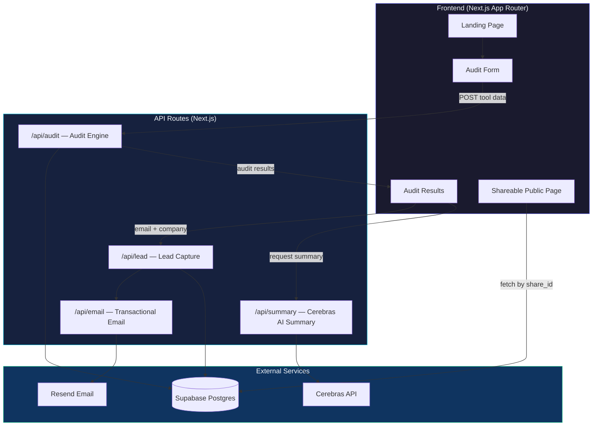

# Architecture — BurnLens

## System Overview

## Data Flow

1. **User lands** on the landing page from a tweet, blog post, or HN link
2. **User inputs** their AI tool stack: tools, plans, monthly spend, seats, team size, use case
3. **Form data persists** in `localStorage` so it survives page reloads
4. **Audit engine** (server-side, rule-based) evaluates each tool:
   - Plan-fit analysis (is this plan right for their team size?)
   - Same-vendor downgrade opportunity
   - Cross-vendor alternative with better pricing
   - Credex credit discount opportunity
5. **Results rendered** with per-tool breakdown and total savings
6. **Cerebras API** generates a ~100-word personalized summary (with templated fallback)
7. **Audit stored** in Supabase with a unique `share_id`
8. **Lead capture** (post-value): email + optional company/role → Supabase
9. **Transactional email** sent via Resend confirming the audit
10. **Shareable URL** (`/audit/[share_id]`) shows the audit without PII

## Stack Justification

| Choice | Why |
|--------|-----|
| **Next.js (App Router)** | SSR for dynamic OG tags on shareable URLs; API routes eliminate need for a separate backend; Vercel deployment is zero-config |
| **TypeScript** | Type safety for the audit engine's pricing data and calculation logic; catches bugs at compile time |
| **Tailwind CSS** | Rapid iteration on a design-heavy product; utility-first approach with CSS custom properties for the design system |
| **Supabase** | Free-tier Postgres with REST API; real relational database (not a toy); built-in Row Level Security |
| **Cerebras API** | Ultra-fast inference for real-time summary generation; cost-effective for a free tool |
| **Resend** | 100 emails/day free tier; excellent DX with React Email templates |
| **Vitest** | Fast, modern test runner with native TypeScript support; excellent for testing pure functions (audit engine) |

## Scaling to 10k Audits/Day

If this tool needed to handle 10,000 audits per day:

1. **Audit engine** — Already stateless and CPU-bound. Runs in Edge Functions on Vercel, auto-scales horizontally.
2. **Database** — Supabase Pro tier handles this volume easily. Add connection pooling via PgBouncer (Supabase includes this). Index on `share_id`.
3. **AI summaries** — Queue with Vercel's edge middleware or a simple job queue. Rate limit Cerebras API calls. Cache repeated audit profiles.
4. **Email** — Move to Resend's paid tier or SES. Process asynchronously via a queue.
5. **CDN** — Vercel's edge network already caches static pages. Dynamic pages (shareable URLs) use ISR with 60s revalidation.
6. **Monitoring** — Add Sentry for error tracking, Vercel Analytics for performance, PostHog for product analytics.
